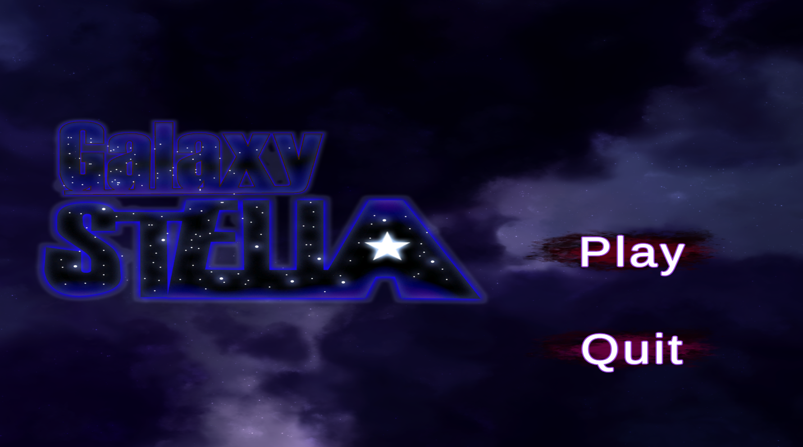
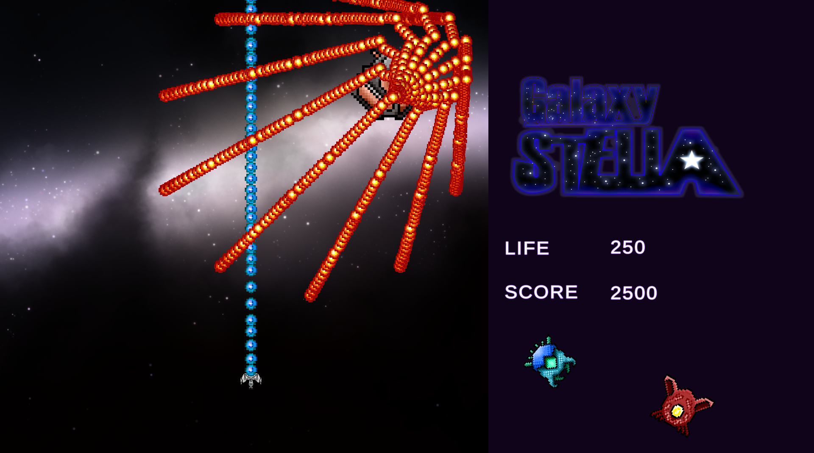
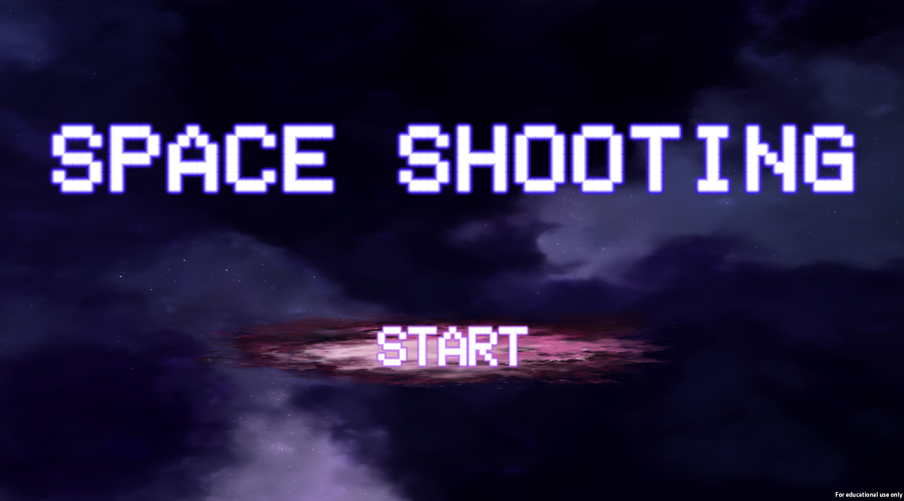
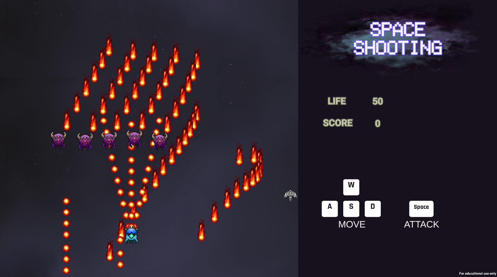

- 長﨑湧斗
- 専門学校デジタルアーツ東京 ゲームプログラムコース 2026年卒業予定

## 資格
- ITパスポート試験合格

## スキル
- C#
  - 利用歴半年
  - Visual Studioで簡単なプログラムを開発可能
- Unity
  - 利用歴半年
  - オリジナルの個人/チーム作品の開発経験あり
- C/C++
  - 利用歴半年
  - コンソールで簡単なデータ処理プログラムを開発可能
- Python
  - 利用歴1.5年
  - 簡単なプログラムを開発可能

## 取り組んでいるテーマ
オリジナルゲーム開発

### 作品リスト
#### VirusBusters
- ウイルスからCPUを、制限時間守り続ける3Dタワーディフェンスゲーム。
- 開発環境：Unity6000.0.44f1
- 開発期間：2025年6月～2025年7月
- 個人製作作品
- ネットの記事を参考にしたり、AIを活用して政策

#### HakoniWorld
- 開発環境：Unity6000.0.44f1
- 開発期間：2025年4月～2025年7月
- グループ開発作品。卒業制作用の作品
- 私は主にシーン遷移や、移動入力。UI制御などを担当
- 現在、鋭意開発中

#### GalaxySTELLA

- 侵略してくる地球外生命体を、弾を撃って倒していく2Dシューティングゲーム。
- 開発環境：Unity2020.3.4f1
- 開発期間：2024年9月～11月
- グループ開発作品。学校の文化祭にて展示
- 私は主にタイトル画面とシステム、ボス戦を担当
- 下記のSPACE SHOOTINGを基に制作
- 現在、こちらのブラッシュアップ版を制作中

#### SPACE SHOOTING

- GalaxySTELLAとそれほど違いはないため、ゲームの概要は省略.
- 開発環境：Unity2020.3.4f1
- 開発期間：2024年8月～8月
- 夏休み時に個人で制作した作品
- webやネットの記事を参考にして制作

## 連絡先
### E-mail [nagasaki.datokyo@gmail.com](nagasaki.datokyo@gmail.com)
